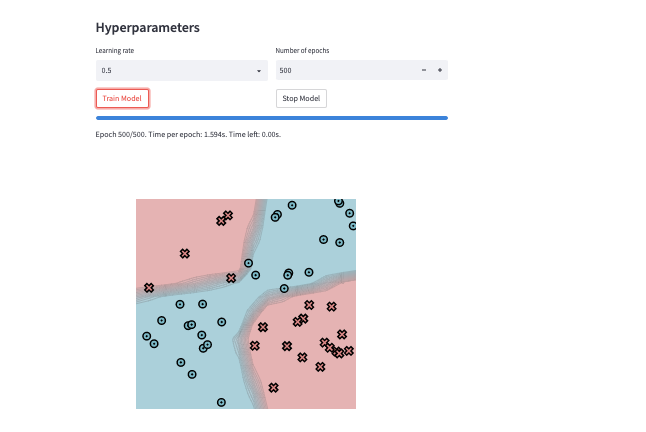

I joined Cornell Tech as a masters student in Computer Science in August 2022. Here's my (late) [tweet](https://twitter.com/mrannanay/status/1575117727102107649) about this new adventure. 
This blog is a Spotify Wrapped :tm: version of my semester.

## Courses taken - 4

1. Applied Machine Learning - Fundamentals of modern Machine Learning algorithms. Starts from regression based algorithms, all the way to Neural Networks. Course content available as a [YouTube Playlist](https://www.youtube.com/watch?v=vcE9WGbi4QY&list=PL2UML_KCiC0UlY7iCQDSiGDMovaupqc83) and [Slides/Lecture Notes](https://github.com/kuleshov/cornell-cs5785-2022-applied-ml) but this one slide covers everything we learnt -

(_Summary slide borrowed from the lectures_).

2. Machine Learning Engineering - Building and scaling a Machine Learning framework - MiniTorch (set to mimic PyTorch).
Course content available at [https://minitorch.github.io/](https://minitorch.github.io/). Finally, the neural networks we built are able to draw boundary lines between points like this, which is surprisingly hard to do!

3. Cryptography - Deep dive into the state of the art Cryptographic primitives. Course content can be found on [Github](https://github.com/tomrist/cs5830-fall2022/tree/main), but this one slide covers everything we learnt -

(_Summary slide borrowed from the lectures_).

4. Product Studio - A great journey through the experience of building a startup. Course details on the [Cornell Tech Website]([url](https://tech.cornell.edu/studio/curriculum/product-studio/)). Obviously I had to ask ChatGPT about the Studio program at Cornell Tech, here's the take -

## Conferences attended - 2

1. SnowFlake Cloud Data Summit - Great place, great energy, lots of folks working in the cloud data storage space. And of course, great swag! 😄 Mandatory [tweet](https://twitter.com/mrannanay/status/1575114449593065475) during the conference.

2. NYC Tech Week - An array of networking events spread through some great locations throughout the city. 
Very interesting backstory on Capital and how the company organized the Tech Week - [https://www.notboring.co/p/capital-and-taste](https://www.notboring.co/p/capital-and-taste). Tweets from the event - 
[memories](https://twitter.com/mrannanay/status/1579630795714883584) bring back [memories](https://twitter.com/mrannanay/status/1579992300511723521) bring back ....

Thanks for reading!
