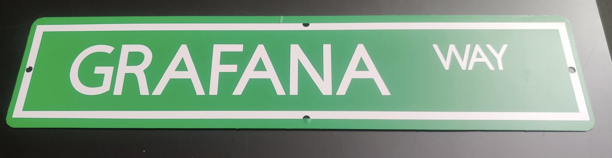
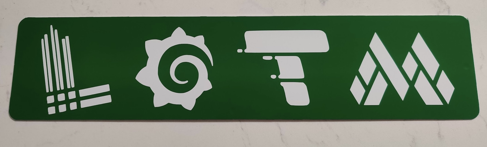

Why would you want to make a Signboard you ask? Cuz it's cool, friend.

Also, I watched some videos from [TheSignGuy](https://www.instagram.com/austinmollno) and went down a rabbithole.

It is surprisingly simple to make a signboard - I thought I'll document the process for everyone :)

## My setup

### 1. First, we need something to cut Vinyl! The [Cricut Maker 2](https://www.amazon.com/dp/B07WGB21KR?ref=ppx_yo2ov_dt_b_fed_asin_title) was a decent place to start.

Cricut comes with a software to create the graphic we would like to cut on the vinyl/other materials. I used the Macbook desktop app to design the graphic and connect with the Cricut to start the cutting process. (The designs I was printing were pretty simple, so it probably took less than 2 min to cut them on the vinyl).

The vinyl then needs to be aligned and pressed onto the base cutting sheet that comes with the Cricut. The Cricut machine and size of the base sheet (somewhat determines the size of boards you can make). The Cricut Maker 2 has a width of 1ft, and I bought a base sheet of length 2ft, so I could cut a single vinyl sheet of size 1ft x 2ft.

### 2. For the base materials, I used some [4x16 aluminum sheets](https://www.amazon.com/dp/B0BZDDHLNX?ref=ppx_yo2ov_dt_b_fed_asin_title) and some [12x12 Plexiglass sheets](https://www.amazon.com/dp/B0CCWQF53H?ref=ppx_yo2ov_dt_b_fed_asin_title).

### 3. We need some [Transfer tape](https://www.amazon.com/dp/B0943DQ9CD?ref=ppx_yo2ov_dt_b_fed_asin_title) to transfer Vinyl onto the base material.

This was confusing to me at first but every Vinyl sheet has two layers: a vinyl layer pasted onto a thin plastic layer. So we need to "transfer" vinyl off this plastic layer and onto the base material we want.

### 4. Finally, we will use a [Cold roll laminator](https://www.amazon.com/dp/B01N7AQMAS?ref=ppx_yo2ov_dt_b_fed_asin_title) to prevent any air bubbles while pressing the vinyl onto the base material.

I bought this after the first few times tring to transfer the vinyl by hand and having tons of air bubbles on the board. I didn't like that too much and decided to buy this to have a smooth finish.

Some boards I've made.

