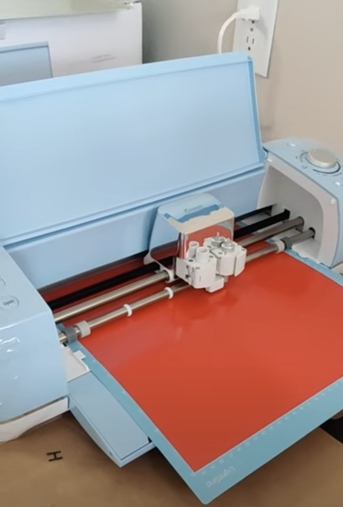
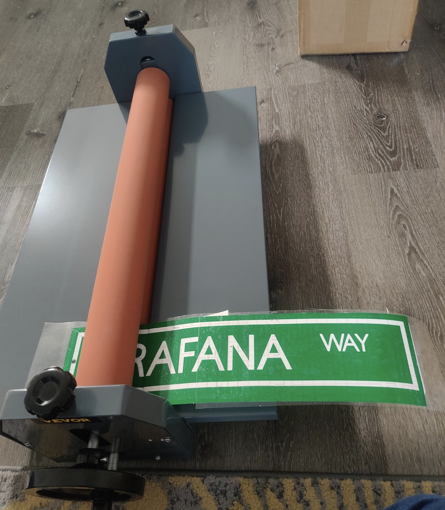

Why would you want to make a Signboard you ask? 

Cuz it's cool, friend.

Also, I watched some videos from [TheSignGuy](https://www.instagram.com/austinmollno) and went down a rabbithole. 

It is surprisingly simple to make a signboard so I thought I'll document the process for everyone :)

## My setup

### 1. First, we need something to cut Vinyl! The [Cricut Maker 2](https://www.amazon.com/dp/B07WGB21KR?ref=ppx_yo2ov_dt_b_fed_asin_title) was a decent place to start.

### 2. For the base materials, I used some [4x16 aluminum sheets](https://www.amazon.com/dp/B0BZDDHLNX?ref=ppx_yo2ov_dt_b_fed_asin_title) and some [12x12 Plexiglass sheets](https://www.amazon.com/dp/B0CCWQF53H?ref=ppx_yo2ov_dt_b_fed_asin_title).

### 3. We need some [Transfer tape](https://www.amazon.com/dp/B0943DQ9CD?ref=ppx_yo2ov_dt_b_fed_asin_title) to transfer Vinyl onto the base material. 

### 4. We'll also need a [Cold roll laminator](https://www.amazon.com/dp/B01N7AQMAS?ref=ppx_yo2ov_dt_b_fed_asin_title) to prevent any air bubbles while pressing the vinyl onto the base material.

Some boards I've made:
